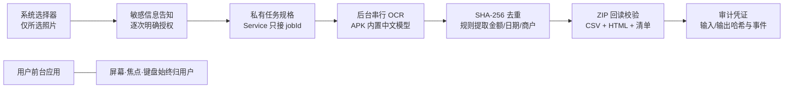

# Quiet Agent v0.2.1

同一台 Android 手机上，用户继续聊天、输入和滚动，Quiet Agent 在后台离线整理用户明确选择的中文票据照片。它不启动其他界面、不模拟触摸、不占用焦点或键盘；每次任务都要单独授权，失败或取消不会发布“完成”结果。



演示范围固定为中文发票与收据照片。一次可选 1–30 张 JPEG/PNG，单张不超过 20 MiB、合计不超过 200 MiB。金额只接受与“合计 / 价税合计 / 总金额”明确关联的候选，使用整数分累计；字段缺失或冲突会进入“待核对”。完全重复图片只 OCR 和归档一次，但报告保留重复映射。

## 部署

1. 在电脑下载 [v0.2.1 Release APK](https://github.com/zihangli-hndsm/quiet-agent-mvp/releases/tag/v0.2.1)，通过 USB 安装到 Android 8+；已针对 Android 12 验收。手机无需访问 GitHub。
2. 当前开发版先选择工作方式和本机范围，再输入任务（可选）。手动文件整理按类型归档；输入“按用途分类我这些简历”可走内容分类：授权本地读取 → 预览并确认发送摘要 → 确认分类 → 生成资料包。Android 12 不允许系统选择器授权存储根目录，必须选择可授权的子目录。
3. 立即切到其他应用正常使用。完成后返回查看待核对报告；导出前会再次确认并打开系统分享面板。

票据识别与规则归档仍在本机运行。当前开发版声明 `INTERNET`，任务描述发送到 DeepSeek；内容分类另行预览授权后发送遮罩后的短文本摘录（不是完整文件），文件名和审计不上传。遮罩不保证消除所有敏感信息，须检查实际预览。支持 DOCX/XLSX/PPTX 和 UTF-8 TXT/MD/CSV；每文件最多1200字符、30个文件、20 MiB/文件、200 MiB/任务。Office 提取正文、共享字符串/内联文本和幻灯片文本，不计算公式、不加载外部链接；PDF、旧版 Office、损坏或无文本文件暂归待核对。`debuggable=false`、`allowBackup=false`。

## 构建与验证

需要 JDK 17、Gradle 8.9、Android SDK 35 / AGP 8.7.3。仓库自带 wrapper；本机脚本默认寻找工作区工具目录，也可设置：

```powershell
$env:QUIET_JDK = "C:\path\to\jdk-17"
$env:QUIET_GRADLE = "C:\path\to\gradle-8.9"
$env:ANDROID_HOME = "C:\path\to\android-sdk"
.\scripts\build.ps1
.\scripts\build-tests.ps1
.\scripts\test-core.ps1
python -m unittest tests/test_verify_receipt_package.py -v
```

产物为 `build/quiet-agent-demo.apk`。构建检查联网声明、不可调试和禁用备份。`QUIET_LLM_KEY_FILE` 指向本地密钥文件（仅嵌入本机 APK，不入库）。测试 APK 的 `content` 场景用虚构 Office 文档验证提取、遮罩、真实云端分类、授权服务、ZIP 校验和快照清理。已发布 v0.2.1 不包含这些开发版功能。

审计凭证用于核对告知、授权、任务绑定、阶段事件和文件哈希，不代表第三方认证或不可篡改。导出的副本不受“清除此任务本地数据”影响。
