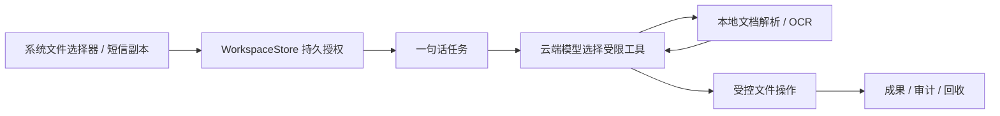

# Quiet Agent MVP

Quiet Agent 把 Android 系统授权的目录、单个文件/图片和短信副本放进一个持续工作区。加入即授权；之后用户只需输入一句话，Agent 会在受限工具循环中探索、读取和整理资料。任务在静音后台服务中运行，不打开别的页面，也不抢前台应用的焦点或键盘。

支持 DOCX、XLSX、PPTX、TXT、Markdown、CSV 与本地中文图片 OCR；可创建文本、CSV、HTML、ZIP，并在有 provider 能力时改名、复制、移动或回收文件。Office 和原始图片不会上传，模型只按需接收提取文字、必要文件名和工作区资源编号。删除和覆盖前先保存可恢复副本。



## 构建与安装

需要 JDK 17、Gradle 8.9、Android SDK 35。仓库自带构建入口；本机路径不同时可设置 `QUIET_JDK`、`QUIET_GRADLE`、`ANDROID_HOME`。

```powershell
.\scripts\build.ps1
adb install -r build\quiet-agent-demo.apk
```

演示 APK 使用 `app/src/main/assets/demo-llm-key` 中的演示密钥；仅用于本次展示，正式产品应改为服务端短期凭证。当前模型端点由 `LlmIntentRouter` 固定为 DeepSeek，不访问被墙服务。

## 样例与验证

- 电脑目录：[`samples/unified`](samples/unified)
- 工作区外对照：[`samples/unified-out-of-scope`](samples/unified-out-of-scope)
- 测试手机：`下载/QuietAgent-Samples-20260914`
- 手机对照目录：`下载/QuietAgent-OutOfScope-20260914`
- 两分钟演示：[`docs/DEMO-UNIFIED-2MIN.md`](docs/DEMO-UNIFIED-2MIN.md)
- 手测清单与实测记录：[`docs/UNIFIED-MANUAL-TEST.md`](docs/UNIFIED-MANUAL-TEST.md)

运行电脑端检查：

```powershell
.\scripts\test-unified-storage.ps1
.\scripts\test-workspace.ps1
.\scripts\test-core.ps1
python -m unittest tests/test_verify_receipt_package.py -v
```

当前真机已验证 SAF 目录加入、真实模型工具循环、DOCX/XLSX 读取、中文票据 OCR、CSV 写入、原文件哈希保持、范围外文件隔离，以及最多 300 条短信的两行预览、全选和不可导入原因。短信实际导入、权限撤销、破坏性操作恢复、取消/进程中断和另一前台应用持续输入仍列为人工验收项。未来 App 执行环境只保留扩展接口，本版不安装 App、不登录账号，也不做通用 GUI 操作。
