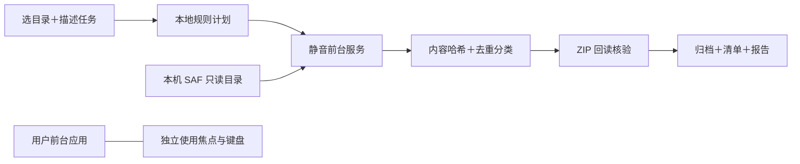

# 静默整理 · Quiet Agent MVP

在同一台 Android 手机上，前台照常输入/使用应用，后台把选定目录去重、分类归档并核验结果。**全离线、原文件只读**；受限自然语言规则规划，不是通用聊天模型或任意 App 操作器。

**部署：**在电脑下载 [Release APK](https://github.com/zihangli-hndsm/quiet-agent-mvp/releases/tag/v0.1.0)，经 USB 安装到 Android 8+（已测 Android 12），手机无需访问 GitHub。打开“静默整理”→从**内部存储**挑选目录，或载入样例→预览→开始。可以离开页面；返回查看报告或导出 ZIP。授权只需部署/选目录时进行。后台有静音持续通知，可取消。

**例句：**`把这个目录里的文件去重，按类型归档`；`只整理PDF和图片，按月份归档`；`最近7天的文档，不去重`。类型依据扩展名，月份依据修改时间。有限关键词解析，请核对计划预览；支持范围见 [架构](docs/ARCHITECTURE.md)。

**构建（Windows）：**JDK 17、SDK Platform 31、Build Tools 30.0.3；`pwsh scripts/build.ps1 -Jdk <目录> -BuildTools <目录> -AndroidJar <android.jar>`。可用环境变量 `QUIET_JDK`、`QUIET_BUILD_TOOLS`、`QUIET_ANDROID_JAR` 代替参数。输出 `build/quiet-agent-mvp.apk`；无需 API Key，APK 不含 INTERNET 权限。

**验证：**`pwsh scripts/test-integration.ps1`（Python 可用 `QUIET_PYTHON`）；`pwsh scripts/test-device.ps1 -Adb <adb.exe>`（或 `QUIET_ADB`，仅 USB）。真机独立前台应用输入期间完成 48 MiB 整理，详见 [验收记录](docs/VALIDATION.md)。自动输入不等价于真人长期使用。

**边界：**单文件 64 MiB、一次选中 1000 文件/256 MiB；仅本机存储提供方。取消/中断不自动重跑，成功结果在完整回读后发布。当前版本为可侧载、可调试的 MVP；长任务保活和不同厂商兼容不作全机型保证。
