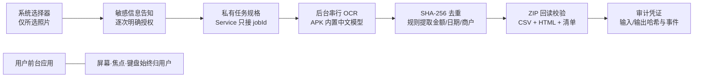

# Quiet Agent v0.2.1

同一台 Android 手机上，用户继续聊天、输入和滚动，Quiet Agent 在后台离线整理用户明确选择的中文票据照片。它不启动其他界面、不模拟触摸、不占用焦点或键盘；每次任务都要单独授权，失败或取消不会发布“完成”结果。



演示范围固定为中文发票与收据照片。一次可选 1–30 张 JPEG/PNG，单张不超过 20 MiB、合计不超过 200 MiB。金额只接受与“合计 / 价税合计 / 总金额”明确关联的候选，使用整数分累计；字段缺失或冲突会进入“待核对”。完全重复图片只 OCR 和归档一次，但报告保留重复映射。

## 部署

1. 在电脑下载 [v0.2.1 Release APK](https://github.com/zihangli-hndsm/quiet-agent-mvp/releases/tag/v0.2.1)，通过 USB 安装到 Android 8+；已针对 Android 12 验收。手机无需访问 GitHub。
2. 打开 Quiet Agent，选择“票据整理”与本机照片。阅读本次范围、目的和风险后点击“授权并开始”。
3. 立即切到其他应用正常使用。完成后返回查看待核对报告；导出前会再次确认并打开系统分享面板。

票据识别与归档仍在本机离线运行。为展示自然语言理解，当前演示 APK 额外声明 `INTERNET`：仅把用户输入的一句话发送给模型，用于在“票据整理 / 原文件整理”之间路由并生成风险提示；照片、文件名、文件内容和审计内容不会上传。`debuggable=false`、`allowBackup=false`。原文件整理入口仍保留，并遵守相同的逐次授权。

## 构建与验证

需要 JDK 17、Gradle 8.9、Android SDK 35 / AGP 8.7.3。仓库自带 wrapper；本机脚本默认寻找工作区工具目录，也可设置：

```powershell
$env:QUIET_JDK = "C:\path\to\jdk-17"
$env:QUIET_GRADLE = "C:\path\to\gradle-8.9"
$env:ANDROID_HOME = "C:\path\to\android-sdk"
.\scripts\build.ps1
.\scripts\build-tests.ps1
.\scripts\test-core.ps1
python -m unittest tests/test_verify_receipt_package.py -v
```

产物为 `build/quiet-agent-demo.apk`。构建脚本会检查最终 Manifest 无联网权限、演示包不可调试且禁用备份。12 张明确标为虚构的样例覆盖 8 张清晰票据、2 张完全重复、1 张金额模糊和 1 张非票据；预期答案只存在于测试。演示步骤见 [docs/DEMO-V02.md](docs/DEMO-V02.md)，真机结果见 [docs/VALIDATION.md](docs/VALIDATION.md)。

审计凭证用于核对告知、授权、任务绑定、阶段事件和文件哈希，不代表第三方认证或不可篡改。导出的副本不受“清除此任务本地数据”影响。
